# PERSONAL TASK MANAGER
---

# Project Code 
WST21-PM-2026-SF

# Student Name
Aldrian A. Cogonon

# Course & Year
BSIT - 2ND YEAR

# Database Used
Mysql

# FEATURES

- Add Task
- View All Tasks
- View Individual Task
- Edit Task
- Delete Task
- Update Task Status
- Search Tasks
- Filter Tasks
- Sort Tasks
- To-Do List
- Dark/Light Mode
- Task Statistics

---

# APPLICATION ARCHITECTURE

The basic flow of my Laravel application is:

**User → Blade View → Route → Controller → Model → Database → Controller → Blade View → User**

The Blade View is what the user interacts with. The Route receives the request and sends it to the correct Controller method. The Controller handles the application logic and uses the Task Model when database data is needed. The Model communicates with the database. The Controller then returns a View or redirects the user.

---

# DASHBOARD

The Dashboard is the main page of TaskFlow. It gives the user an overview of their tasks and provides quick access to the main task management features.

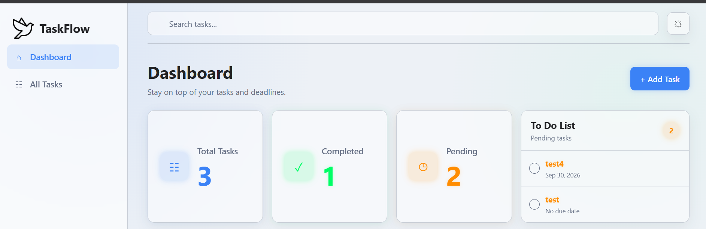
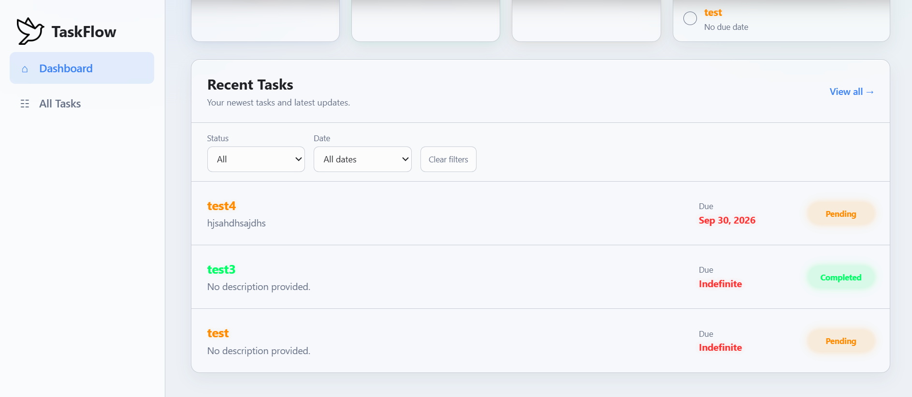
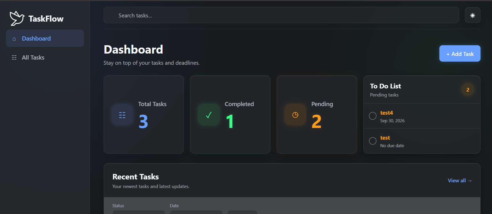
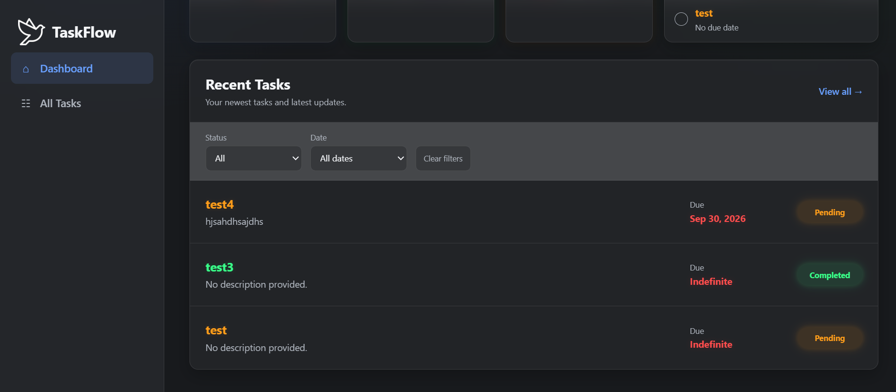
## 1. Sidebar Navigation

The sidebar is located on the left side of the Dashboard. It contains the TaskFlow logo and two navigation links:

- **Dashboard** - opens the main Dashboard page.
- **All Tasks** - opens the page containing the complete task list.

The links use Laravel named routes such as **tasks.index** and **tasks.all**.

## 2. Search Bar
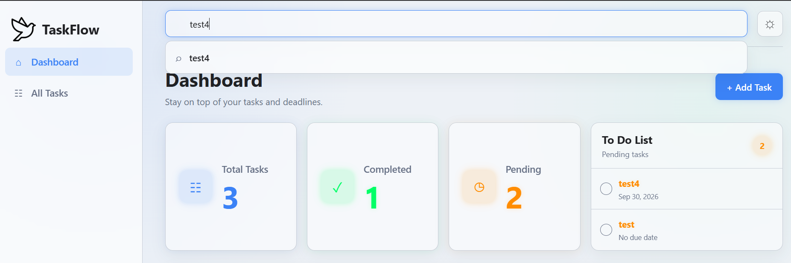
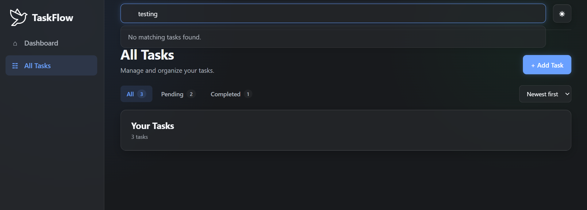

The Dashboard has a global search bar at the top. It searches tasks by task name.

The search uses **searchResults.js** and the Laravel **tasks.search** route.

The flow is:

**User types a task name → searchResults.js detects the input → Wait 300 milliseconds → fetch() sends the search request → /tasks/search?q=... → TaskController@search → Task model searches task_name → Laravel returns JSON → JavaScript displays the results → User clicks a result → The selected task's View page opens**

The Controller uses a **LIKE** query, so part of a task name can match the search.

## 3. Dark/Light Mode

The Dashboard has a theme button that switches between light mode and dark mode.

The theme is handled with JavaScript, **localStorage**, and CSS variables.

The selected theme is stored using:

**taskflow-theme**

The JavaScript changes the page to use **data-theme="light"** or **data-theme="dark"**. The CSS variables then change the colors of the interface.

## 4. Dashboard Header

The Dashboard header contains the page title, a short description, and the **Add Task** button.

The Add Task button uses the **tasks.create** route to open the Create Task form.

The flow is:

**Click Add Task → tasks.create → TaskController@create → create.blade.php**

## 5. Task Statistics

The Dashboard shows three statistics:

- **Total Tasks** - counts all tasks.
- **Completed** - counts tasks with **completed** status.
- **Pending** - counts tasks with **pending** status.

The values come from the **$tasks** collection prepared by **TaskController@index**.

The Controller gets the tasks using:

**$tasks = Task::latest()->get();**

The data is then passed to the Blade view using:

**return view('tasks.index', compact('tasks', 'pendingTasks'));**

## 6. To-Do List

The To-Do List shows pending tasks that still need to be completed.

The Controller creates the list using:

$pendingTasks = $tasks
    ->where('status', 'pending')
    ->sortBy(function ($task) {
        return $task->due_date ?? '9999-12-31';
    })
    ->take(6);

This means the Controller:

1. Keeps only pending tasks.
2. Sorts them by due date.
3. Places tasks without a due date toward the end.
4. Shows a maximum of six tasks.

Each To-Do item shows the task name and due date.

## 7. Completing a Task

The circular checkbox in the To-Do List sends a PATCH request to:

**/tasks/{id}/status**

The flow is:

**Click checkbox → PATCH /tasks/{id}/status → tasks.updateStatus → TaskController@updateStatus → Update the status in the database**

The Controller changes the status using:

$task->status === 'pending'
    ? 'completed'
    : 'pending'

So the status changes between:

pending → completed
completed → pending

## 8. Recent Tasks

The Recent Tasks section shows up to ten of the newest tasks.

The Controller retrieves tasks using:

Task::latest()->get();

The Dashboard then uses:

$tasks->take(10)

Each task displays its name, description, due date, and status.

The Recent Tasks section is read-only. The user cannot edit, delete, or change the status directly from this section.

## 9. Status Filter
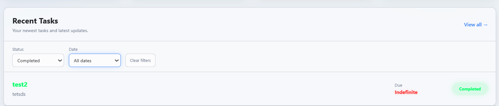
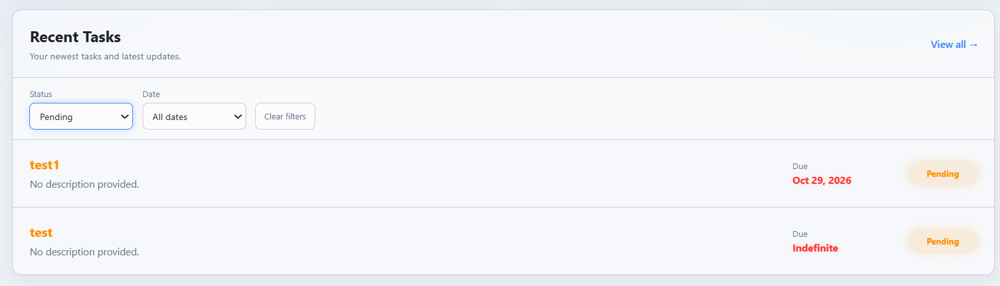

The Recent Tasks section has a Status filter with:

- All
- Pending
- Completed

The tasks contain a **data-status** value, and **dashboard.js** checks this value to show only the tasks that match the selected status. This filtering is done in the browser using the tasks that are already on the page.

## 10. Date Filter
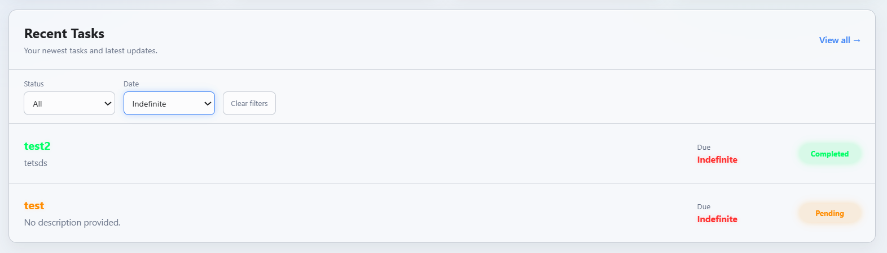
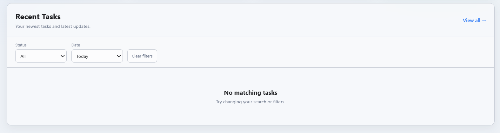
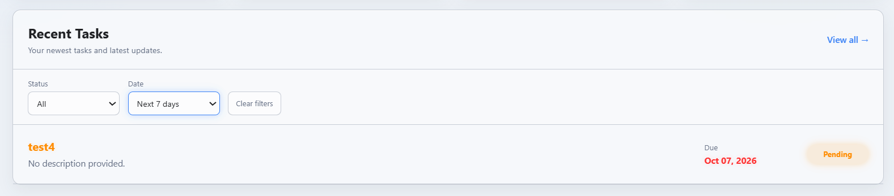
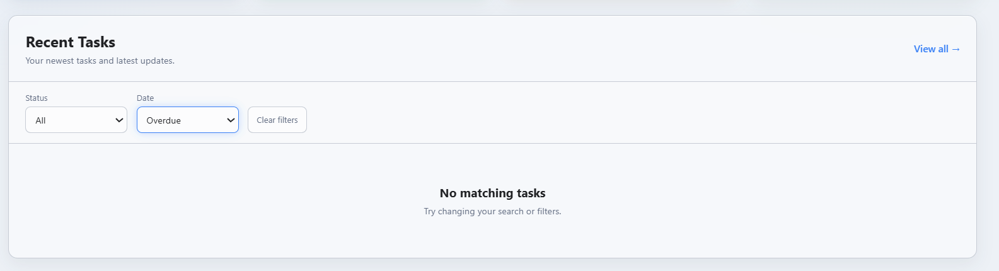
The Recent Tasks section also has a Date filter with:

- All dates
- Today
- Next 7 days
- This month
- Overdue
- Indefinite

The JavaScript reads each task's due date and compares it with the current date. The user can also combine the Status and Date filters. A task must match both selected conditions to remain visible.

## 11. Clear Filters
The Clear filters button removes the currently selected Status and Date filters from the Recent Tasks section. When clicked, JavaScript resets the Status filter to All and the Date filter to All dates. The tasks are then checked again, allowing all recent tasks that were previously hidden by the filters to be displayed.

**Click Clear Filters → Reset Status → Reset Date → Check Tasks Again → Show Recent Tasks**

## 12. View All

The View all → link takes the user from the Dashboard to the All Tasks page. It uses the tasks.all route, which calls TaskController@allTasks to retrieve the tasks and display them in all_tasks.blade.php. This gives the user access to the complete task list and additional task management features such as viewing, editing, deleting, filtering, sorting, and updating task status.

**Click View All → tasks.all → TaskController@allTasks → All Tasks Page**

## 13. Dashboard Empty States

The Dashboard also handles cases where there is no data to display.

- If there are no pending tasks, the To-Do List shows **No pending tasks**.
- If there are no tasks, Recent Tasks shows **No tasks yet**.
- If filters do not match any task, the Dashboard shows **No matching tasks**.

## Dashboard Flow

User opens / →
tasks.index →
TaskController@index →
Task::latest()->get() →
Prepare $tasks and $pendingTasks →
index.blade.php →
Dashboard is displayed →
JavaScript handles filters, theme, and search interaction

---

# ALL TASKS

The All Tasks page displays the complete list of saved tasks and provides the main task management controls.

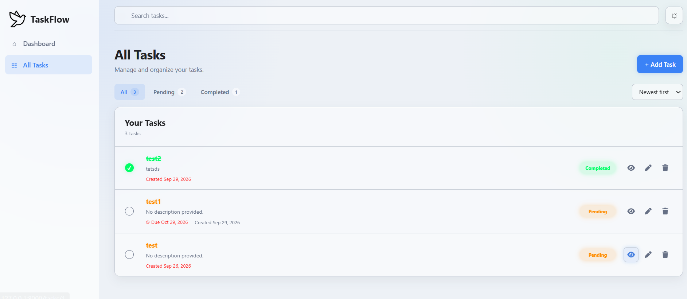

The page can:

- Filter tasks by status
- Search loaded task rows
- Sort tasks
- View an individual task
- Edit a task
- Delete a task
- Add a task
- Change a task's status
- Open the Create Task page

## Status Filter
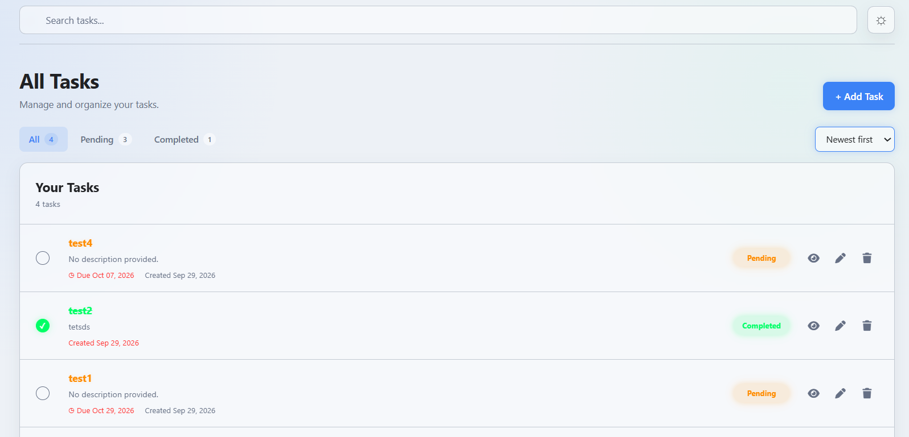
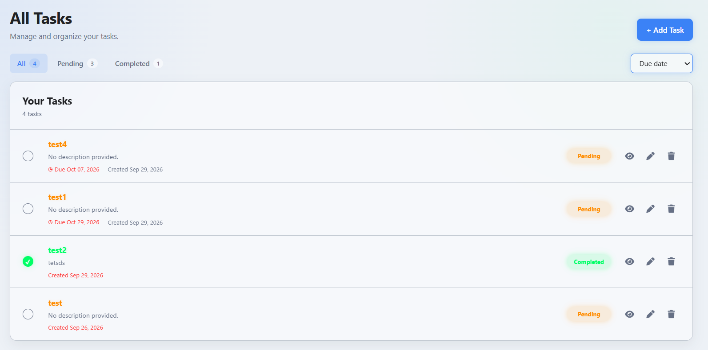
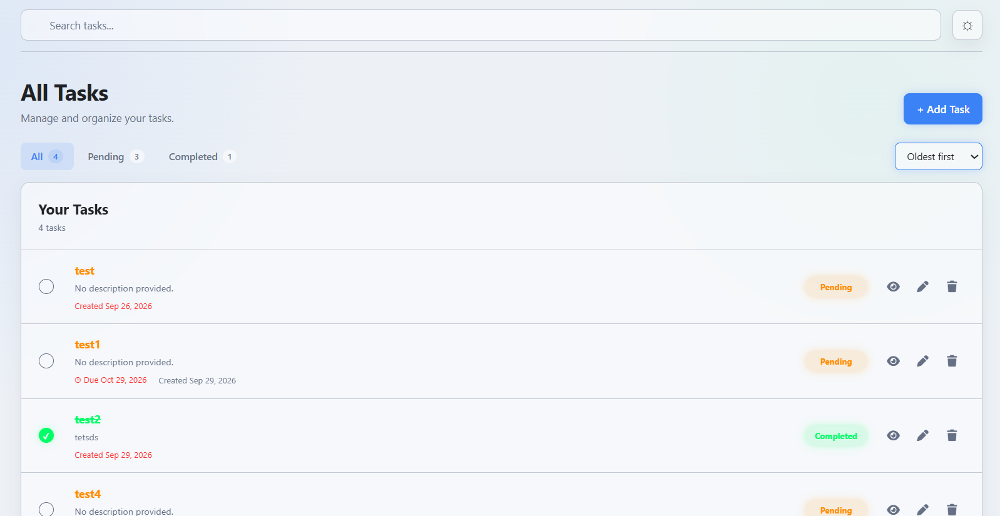
The All Tasks page has All, Pending, and Completed filters.

**all_tasks.js** reads the task's **data-status** value and shows only the tasks that match the selected filter.

## Search

The All Tasks page also has a local search. Instead of making a new database request, **all_tasks.js** checks the text of the task rows that are already loaded on the page.

This is different from the global search, which calls Laravel's **/tasks/search** endpoint.

## Sorting

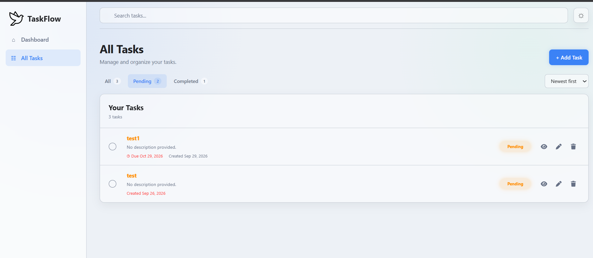
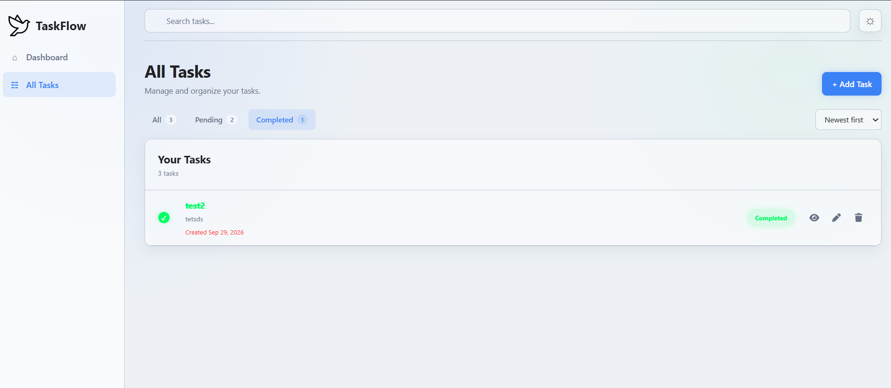
The All Tasks page can sort the loaded rows by:
- Newest
- Oldest
- Due Date

The JavaScript reads the task dates stored in the row's **data-created** and **data-due** values and changes the order of the rows.

## View Task
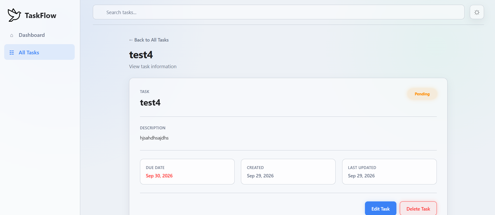
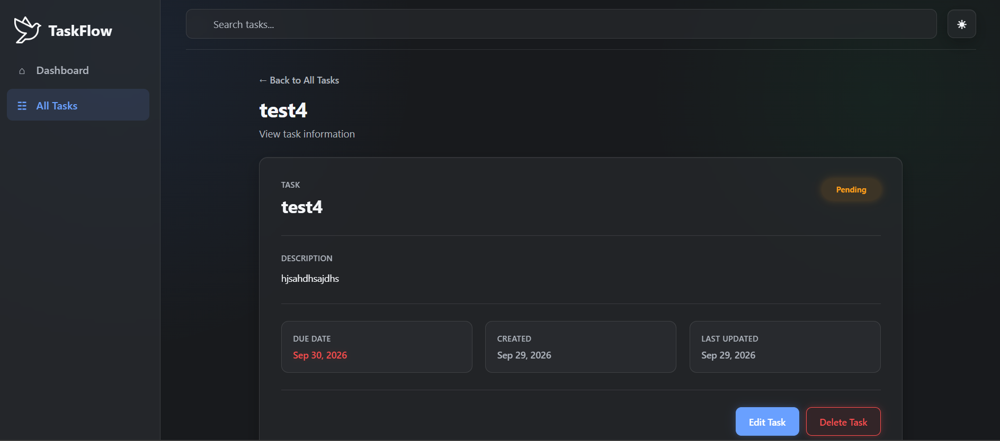
Each task has a View icon using:

{{ route('tasks.show', $task->id) }}

For a task with ID 3, the link becomes:

**/tasks/3**

Laravel uses the **tasks.show** route and the **show(Task $task)** Controller method to find and display that specific task.

## Edit Task
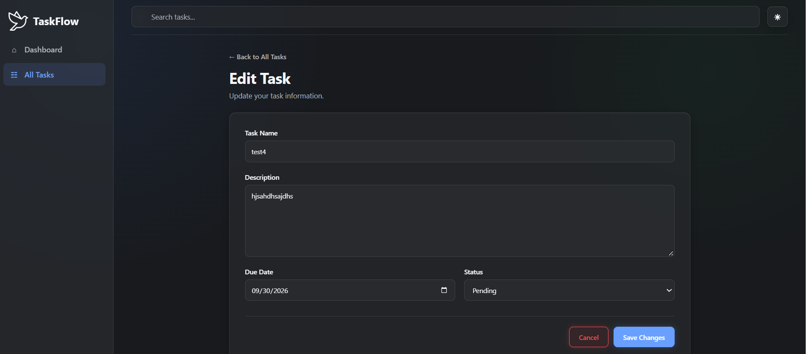
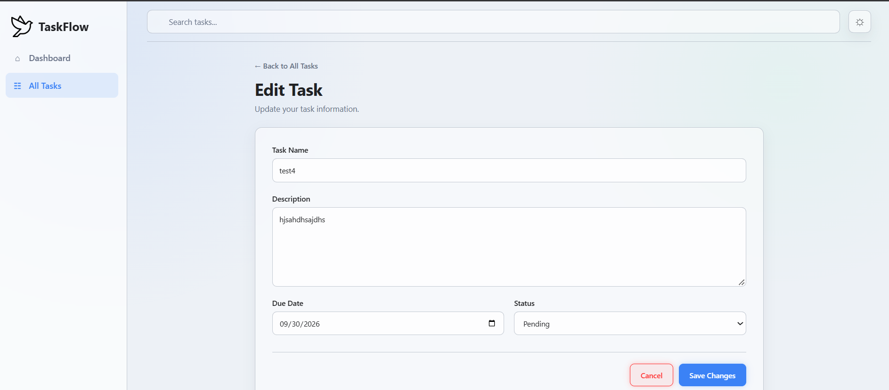
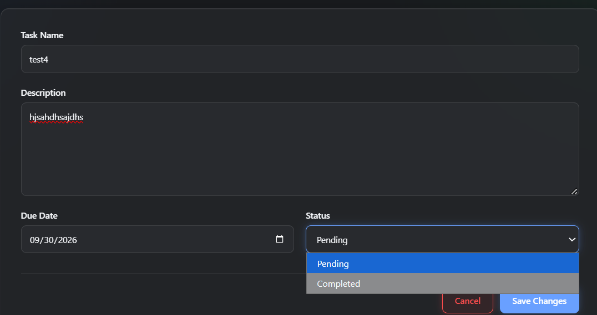
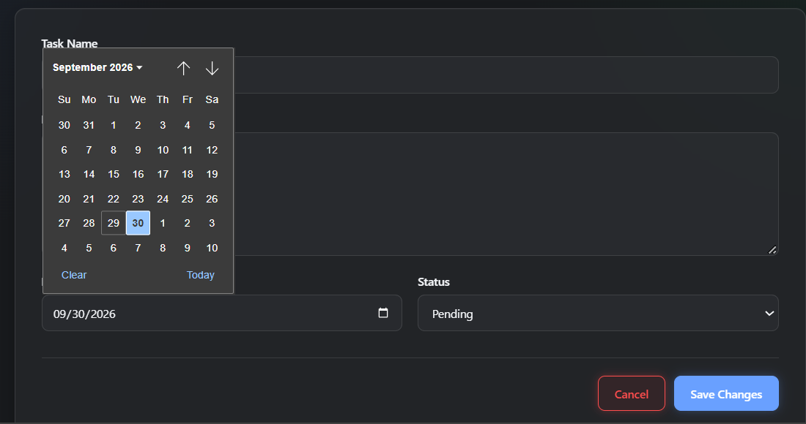
The Edit icon opens:

**/tasks/{id}/edit**

The Controller receives the task, sends it to **edit.blade.php**, and the form displays the current values.

## Delete Task
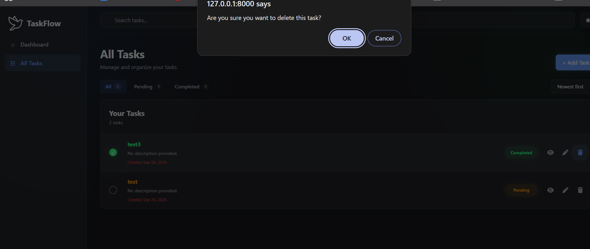
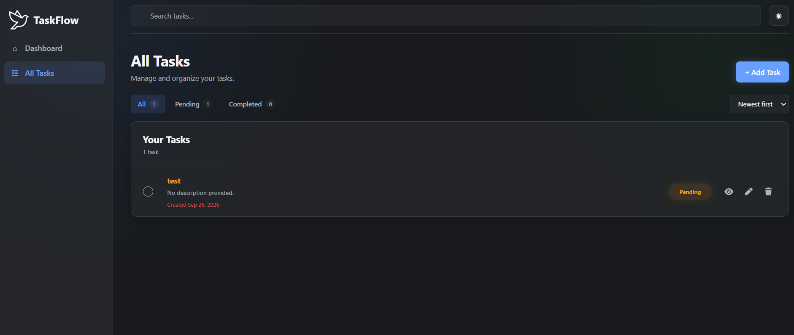
The Delete button submits a DELETE request to:

**/tasks/{id}**

The Controller then uses:

**$task->delete();**

to remove the task from the database.

## Status Control

The circular status button sends a PATCH request to:

**/tasks/{id}/status**

The Controller changes the status between pending and completed.

---

# CREATE TASK
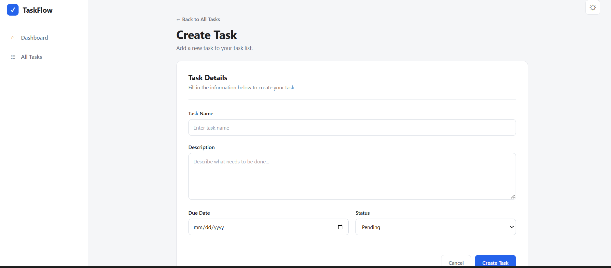
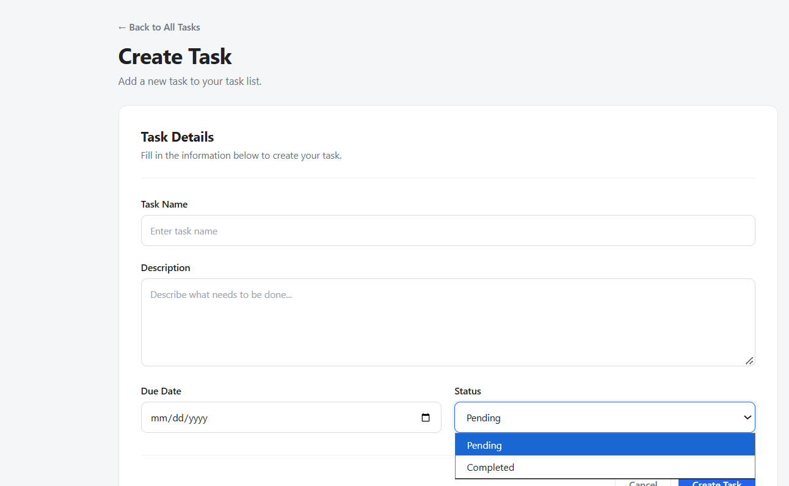
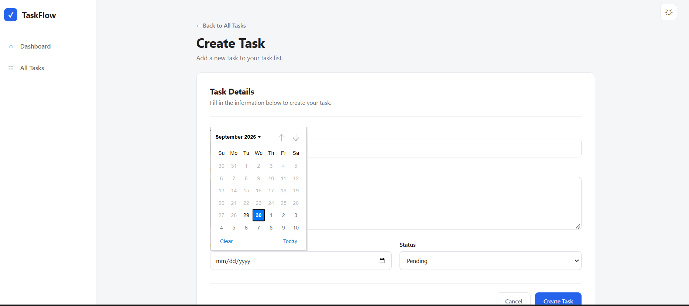
The Create Task page is stored in:

**resources/views/tasks/create.blade.php**

The page is opened with:

**GET /tasks/create**

which calls:

**TaskController@create**

The Controller returns the Create Task Blade view.

## Form Submission

When the user submits the form, it sends:

**POST /tasks**

The route calls:

**TaskController@store**

The flow is:

Fill out the form

**Click Create Task → POST /tasks → tasks.store → TaskController@store → Validate the form → Task::create() → Database → Redirect to All Tasks**

## Validation

The Controller validates the data using:

$validated = $request->validate([
    'task_name' => 'required|max:255',
    'description' => 'nullable',
    'status' => 'required|in:pending,completed',
    'due_date' => 'nullable|date|after_or_equal:today',
]);

The validation means:

- **task_name** is required and has a maximum length of 255 characters.
- **description** can be empty.
- **status** must be either **pending** or **completed**.
- **due_date** can be empty, but when entered it must be a valid date that is today or later.

After validation, the task is saved with:

**Task::create($validated);**

---

# VIEW INDIVIDUAL TASK

The View Task page shows one specific task instead of the entire task list.

The route is:

**GET /tasks/{task}**

and the Controller method is:

public function show(Task $task)
{
    return view('tasks.show', compact('task'));
}

Laravel uses route model binding to find the task using the ID in the URL.

The View page displays:

- Task name
- Status
- Description
- Due date
- Created date
- Last updated date

The page also provides Edit Task and Delete Task actions.

The flow is:

**Click View icon → /tasks/{id} → tasks.show → TaskController@show → Find the Task → show.blade.php → Display task details**

---

# EDIT TASK

The Edit Task page uses:

**GET /tasks/{task}/edit**

The route calls:

**TaskController@edit**

The Controller sends the selected Task to:

**edit.blade.php**

The form displays the existing values of the task.

When the user saves the changes, the form uses PUT:

**PUT /tasks/{id}**

and calls:

**TaskController@update**

The Controller validates the updated information and uses:

**$task->update($validated);**

to update the existing database record.

The edit validation is:

$validated = $request->validate([
    'task_name' => 'required|max:255',
    'description' => 'nullable',
    'status' => 'required|in:pending,completed',
    'due_date' => 'nullable|date',
]);

---

# DELETE TASK

The Delete button submits a DELETE request using Laravel method spoofing.

The route is:

**DELETE /tasks/{id}**

and the Controller uses:

**$task->delete();**

to remove the task from the database.

If there are no tasks left, the application resets the table's AUTO_INCREMENT value to 1.

The flow is:

**Click Delete → DELETE /tasks/{id} → tasks.destroy → TaskController@destroy → $task->delete() → Database → Redirect to All Tasks**

---

# DATABASE

The application uses a task_manager database with a main tasks table.

The migration file is:

**database/migrations/2026_09_21_181234_create_tasks_table.php**

The table contains:

Field               Purpose
- id                Unique ID of the task
- task_name         Name of the task
- description       Additional task information
- status            pending or completed
- due_date          Task deadline, if provided
- created_at        Date and time the record was created
- updated_at        Date and time the record was last updated

---

# TASK MODEL

The Task model is:

**app/Models/Task.php**

It extends Laravel's Eloquent Model class.

The model defines the fields that can be mass assigned:

protected $fillable = [
    'task_name',
    'description',
    'status',
    'due_date',
];

It also casts the due date as a date:

protected $casts = [
    'due_date' => 'date',
];

This allows the Blade files to format the date easily.

---

# ELOQUENT

I use the Task model and Eloquent methods instead of writing raw SQL for the basic task operations.

Examples used in the project:

Task::latest()->get();
Task::create($validated);
$task->update($validated);
$task->delete();

These are used to retrieve, create, update, and delete task records.

---

# BLADE AND FORMS

I use Blade to display task data and connect the interface to Laravel routes.

For example:

{{ $task->task_name }}

which displays a task name.

The project also uses Blade directives such as:

- @if
- @forelse
- @empty
- @csrf
- @method
- @error

## CSRF

The forms use:

**@csrf**

This adds Laravel's CSRF token to the form so Laravel can verify the request.

## Method Spoofing

The forms use:

@method('PUT')
@method('PATCH')
@method('DELETE')

Method spoofing lets us use PUT, PATCH, and DELETE even though normal HTML forms mainly support GET and POST. I use it so each action clearly shows its purpose, like PATCH for changing status and DELETE for deleting a task. It makes the code more organized and follows the way Laravel handles CRUD operations.

---

# JAVASCRIPT

JavaScript is used for features that need interaction in the browser.

## dashboard.js

Handles:

- Dashboard status filtering
- Dashboard date filtering
- Clear filters
- Dark/light mode

## all_tasks.js

Handles:

- All Tasks status filtering
- Searching the loaded task rows
- Sorting by newest
- Sorting by oldest
- Sorting by due date

## searchResults.js

Handles the global search bar. It sends the search request to Laravel, receives JSON, and displays the search results.

## darkmode.j`

Handles the theme toggle by changing the current **data-theme** and saving the selected theme in **localStorage**.

---

# CRUD FLOW

## Create

Creating a task starts from the Create Task form in create.blade.php. When the user submits the form, Laravel receives the POST request through tasks.store, and TaskController@store validates the data before using Task::create() to save it to the database.

**create.blade.php → POST /tasks → tasks.store → TaskController@store → Validate the form → Task::create() → Database → Redirect to All Tasks**

## Read

**View All Tasks**
Reading tasks means retrieving the tasks from the database and displaying them to the user. In my project, TaskController@allTasks uses the Task model to get the tasks and passes them to all_tasks.blade.php, where the complete task list is displayed.

**/tasks/all → tasks.all → TaskController@allTasks → Task::latest()->get() → Database → all_tasks.blade.php → Display all tasks**

**View Individual Task**

The individual View feature allows the user to see the details of one specific task instead of the entire list. When the user clicks the eye icon, the task ID is included in the URL, Laravel uses route model binding to find the Task, and TaskController@show sends it to show.blade.php.

**Click View icon → /tasks/{id} → tasks.show → TaskController@show → Find the Task → show.blade.php → Display task details**

## UPDATE

Updating a task starts from the Edit page, where the existing task information is loaded into the form. After the user submits the changes, Laravel treats the request as PUT, TaskController@update validates the data, and $task->update() saves the changes to the existing database record.

**edit.blade.php → PUT /tasks/{id} → tasks.update → TaskController@update → Validate the form → $task->update() → Database → Redirect to All Tasks**

### Delete

Deleting a task is done through the Delete form in the All Tasks or View Task page. The form sends a DELETE request to the tasks.destroy route, which calls TaskController@destroy and uses $task->delete() to remove the selected record from the database.

**Delete form → DELETE /tasks/{id} → tasks.destroy → TaskController@destroy → $task->delete() → Database → Redirect to All Tasks**

---

# COMPLETE FEATURE FLOW

                    TASKFLOW
                       |
          ---------------------------
          |                         |
          |                         |
      Blade Views              JavaScript
          |                         |
          |                         |
        Routes                 Browser Interaction
          |
          |
     TaskController
          |
          |
       Task Model
          |
          |
      Mysql
          |
          |
      tasks table

The main task request flow is:

**User → Blade → Route → Controller → Model → Database → Controller → Blade**

The project uses this structure for all major task operations, while JavaScript handles features that can be performed directly in the browser.

