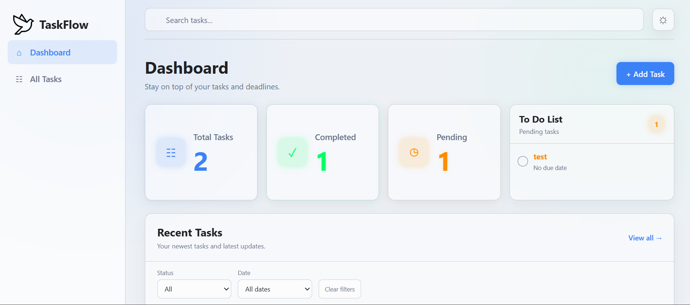
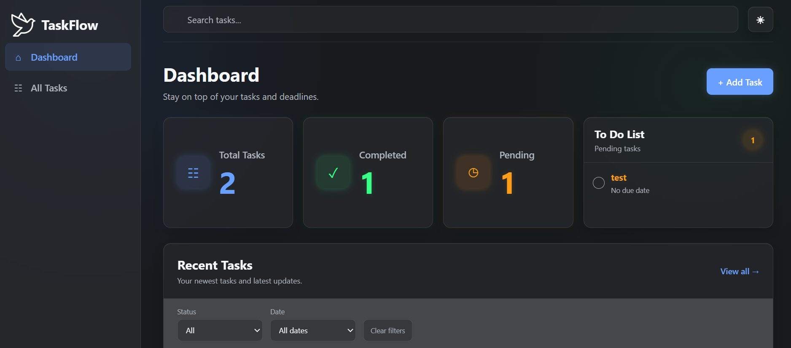

# STUDENT INFORMATION
* **Project Code:** WST21-PM-2026-SF
* **Student Name:** Aldrian A. Cogonon
* **Course & Year:** BSIT-2Y
* **Database Used:** MYSQL

# Personal Task Manager

A simple, lightweight personal task manager built with Laravel, PHP, and MariaDB for managing daily tasks and assignments.

---

## Features
* **ADD TASK**
* **VIEW TASKS**
* **EDIT TASK**
* **DELETE TASK**
* **UPDATE STATUS** 
* **SEARCH BAR**
* **DARK/LIGHT MODE**
* **TO-DO LIST**
---

## Tech Stack
* **Backend:** PHP / Laravel
* **Database:** MYSQL
* **Frontend:** HTML, CSS (Blade Views)
* **OS Environment:** Arch Linux
---
##LIGHT MODE/TO-DO LIST/SEARCH BAR

---
##DARK MODE/TO-DO LIST/SEARCH BAR

